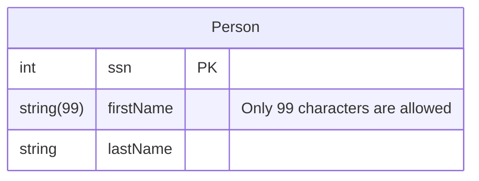
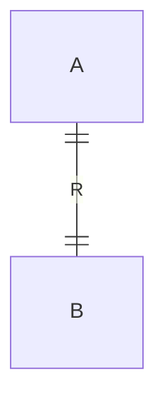
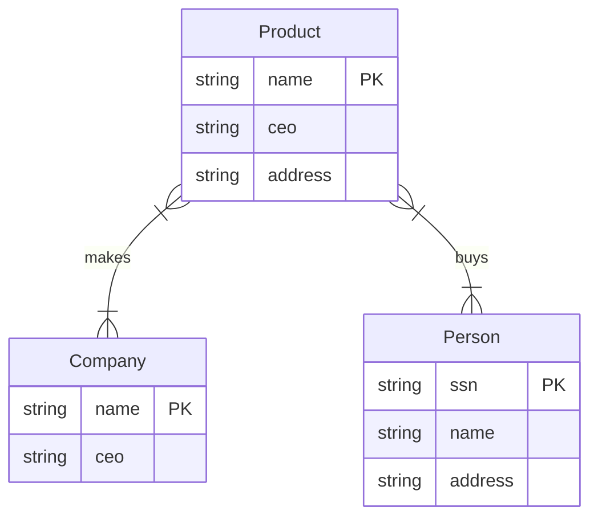
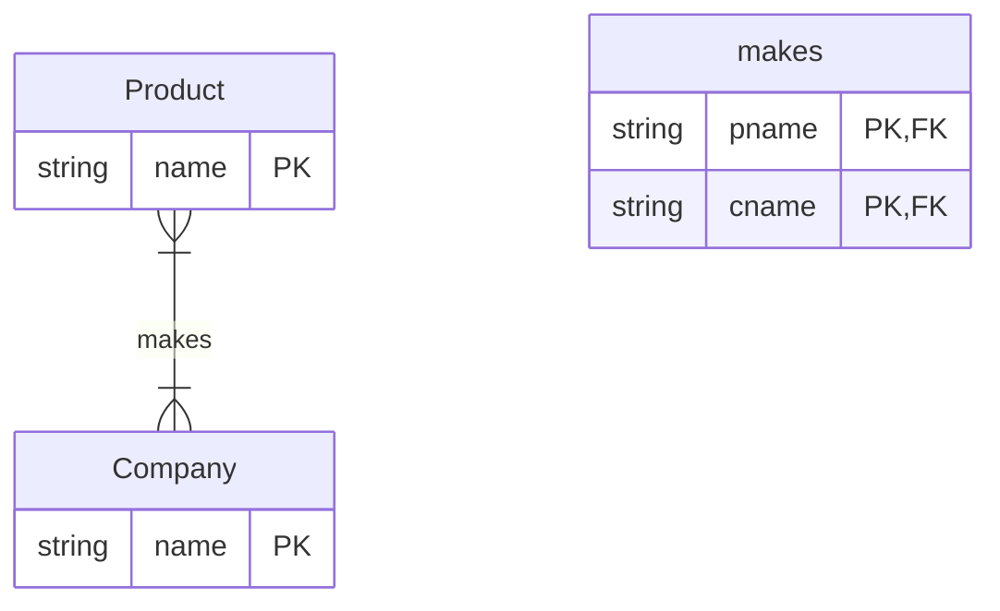
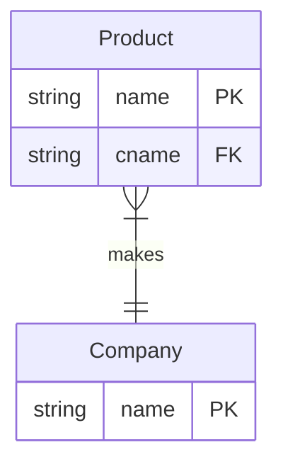
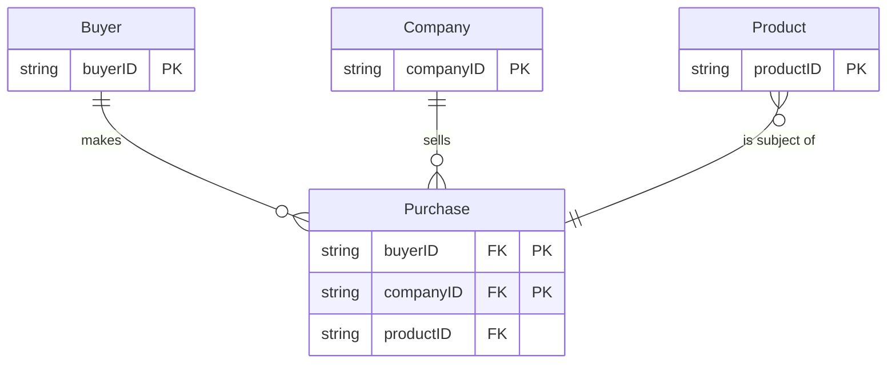
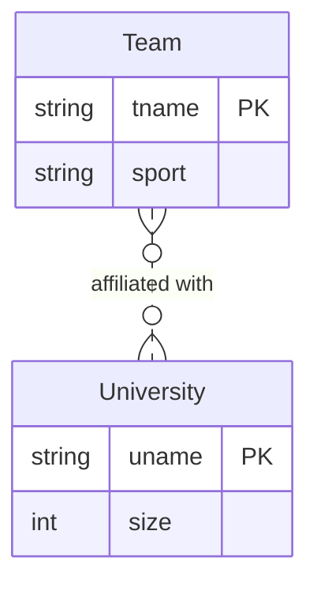

## Components (rendered by Mermaid.js)
**Entity Set / Class**
- Represented by `{}`

**Attributes / fields**
- Represented by `type: name`
- Primary key is marked by PK, Foregin key is marked by FK, Unique key is marked by UK
      - additionl column would be added to do the annotation
  
**Relationships**
- Represented by cardinality syntax:
    - `|o` / `o|` : zero or one
    - `||` / `||` : exactly one
    - `}o` / `o{` : zero or more
    - `}|` / `|{` : one or more
      
**Subclass (Inheritance)**
- Represented by `--|>` arrow
  
**Weak Entity**
- Usually represented with double rectangle/border
- Depends on another entity for identification
- Example: `[WeakEntity][[` or similar double notation

```sql
/* ex. Entity: Person, Attributes: Address, Name, SSN* 8?*/
CREATE TABLE Person (ssn INT PRIMARY KEY,
                     name TEXT,
                     address TEXT);
```

## Relationships
If A and B are sets, then a relationship R is a subset of A x B

Let's try to create the relationship diagram between Company(name*, ceo, address), Product(price, name*), Person(address, name, ssn*) with subsets that connect them: make, buys, employs



```sql
CREATE TABLE Makes
(pname text references Product(name),
cname text references Company(name)); /* say we want to cross-reference the product name to the company where it is producted*/


CREATE TABLE Buys
(pname text references Product(name),
paddress text references Person(address)); /* say we want to know where the buyer is from and what did they buy*/
```
## Relationship Multiplicity
There are 3 types:
- Many-to-Many
- One-to-One
- Many-to-One

**Many-to-Many**
- Example: a company can make multiple products, a product can be made by multiple companies

```sql
CREATE TABLE Product (
        name VARCHAR(100) PRIMARY KEY,...);

CREATE TABLE Company (
        name VARCHAR(100) PRIMARY KEY, ...);

CREATE TABLE Makes (
    cname VARCHAR(100) REFERENCES Company(name), 
    pname VARCHAR(100) REFERENCES Product(name),
);
```

**One-to-One**
- Example: only a single company can make that particular product, a product can only made by single company


```sql
CREATE TABLE Product (
        name VARCHAR(100) PRIMARY KEY,...);

CREATE TABLE Company (
        name VARCHAR(100) PRIMARY KEY, ...);

CREATE TABLE Makes (
    cname VARCHAR(100) UNIQUE REFERENCES Company(name), 
    pname VARCHAR(100) UNIQUE REFERENCES Product(name),
);
```

**Many-to-one**
- Example: each product is only made by a single company


```sql
CREATE TABLE Product (
        name VARCHAR(100) PRIMARY KEY,...);
        cname VARCHAR(100) REFERENCES Company(name); /* you should always store your many-to-one relationships in the entity set tables */

CREATE TABLE Company (
        name VARCHAR(100) PRIMARY KEY, ...);
```

Notice that, in this case, your makes table is unessesary

## Multiplicity: the cardinality syntax - what to use
- sometimes, you might want to ensure the existence of relation (e.g. attribute not optional), so you would use NOT NULL in CREATE TABLE
- sometimes, you may also want to limits the entry of the table
```sql
CREATE TABLE Company (
    name VARCHAR(100) PRIMARY KEY
    -- other columns...
);

CREATE TABLE Product (
    name VARCHAR(100) PRIMARY KEY,
    cname VARCHAR(100) NOT NULL REFERENCES Company(name), /* in the many-to-one relationship a company is required to begin with such that the product could exist */
    quantity INT CHECK (quantity < 20), /* condition that ensures a  less than 20 statement */
);
```
## Multi-Way Relationships
- Most relationships are between two entity sets
   - Product – Company
   - Student – Course
   - Company – Employee
- However, in some relationships, you will have more than one entity set connected by a subset

In this table creation example, we have multi-way relationship with a constraint of buyer always buy with the same product, regardless of what company made it
```sql
CREATE TABLE Company (
      name VARCHAR(100) PRIMARY KEY,
      ...);
CREATE TABLE Buyer (
      id INT PRIMARY KEY,
      ...);
CREATE TABLE Purchase (
      cname VARCHAR(100) REFERENCES Company,
      pname VARCHAR(100) REFERENCES Product,
      bname INT REFERENCES Buyer,
      PRIMARY KEY (pname, bname), /* a buyer always buy with the same product*/
      ...);
```

In this mermaid diagram example, we ask to see a loyal customer to make buying of same company (PRIMARY KEY (bname, cname))

## Subclassing
An entity set may be a subclass of another entity set
- Implicitly inherits all the attributes, keys, and relationships of the superclass

Subclassing can be represented using foregin keys or inheritance suppport (depending on your db)

## Weak Entity Set
An entity where its relation to another entity is not unique


```sql
CREATE TABLE University
      (uname VARCHAR(64) PRIMARY KEY,
      size int);
CREATE TABLE Team
      (tname VARCHAR(64),
      uname VARCHAR(64) REFERENCES University,
      sport VARCHAR(64),
      PRIMARY KEY (tname, uname));
```
## Attribute and Tuple-level Constraints
Use CHECK (condition) to tell how we should constraint at the attribute / tuple level

```sql
CREATE TABLE User (
      uid INT PRIMARY KEY,
      firstName TEXT,
      lastName TEXT,
      age INT CHECK (age > 12 AND age < 120),
      email TEXT,
      phone TEXT,
      CHECK (email IS NOT NULL OR phone IS NOT NULL)
      );
```

Or use  ASSETION ... CHECK (condition) for the whole table / query (very expensive though)
```sql
CREATE ASSERTION myAssert CHECK
      (NOT EXISTS (
      SELECT Product.name
      FROM Product, Purchase
      WHERE Product.name = Purchase.prodName
      GROUP BY Product.name
      HAVING COUNT(*) > 200)
      );
```

Or use **Referntial Constraints**, the use of foregin key

**Referntial Constraints**
- to maintin references during row update or delete, you can use ON UPDATE / ON DELETE with few options
  - CASCADE: Update/delete referencers
  - SET NULL: Set referencers’ field to NULL
  - SET DEFAULT: Set referencers' field to their default
  - NO ACTION (default): throw an error
```sql
CREATE TABLE Company (
      name VARCHAR(100) PRIMARY KEY);
CREATE TABLE Product (
      name VARCHAR(100) PRIMARY KEY,
      cname VARCHAR(100)
      REFERENCES Company
      ON UPDATE CASCADE
      ON DELETE SET NULL);
```
